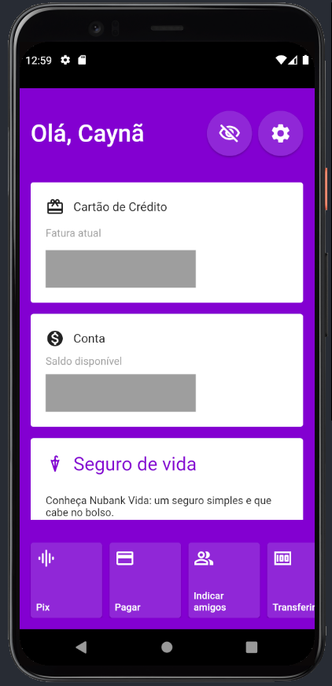

# Réplica Tela Nubank

- Tela Nubank com funcionalidade de esconder conteúdo dos cards que são mostrados na tela, com conteúdo mais sensível, como o saldo do cliente e informações do cartão de crédito.
- Esta tela possui uma rolagem dinâmica tanto para os cards principais que estão na vertical, tanto para o menu horizontal de botões na parte inferior da tela.
- Tanto os cards como o menu de botões inferior podem conter mais elementos, que serão adionados conforme o desejo do usuário.

## Funcionalidade:
- Ao clicar no ícone do olhinho, o ícone muda, assim como o conteúdo dos cards é escondido.

